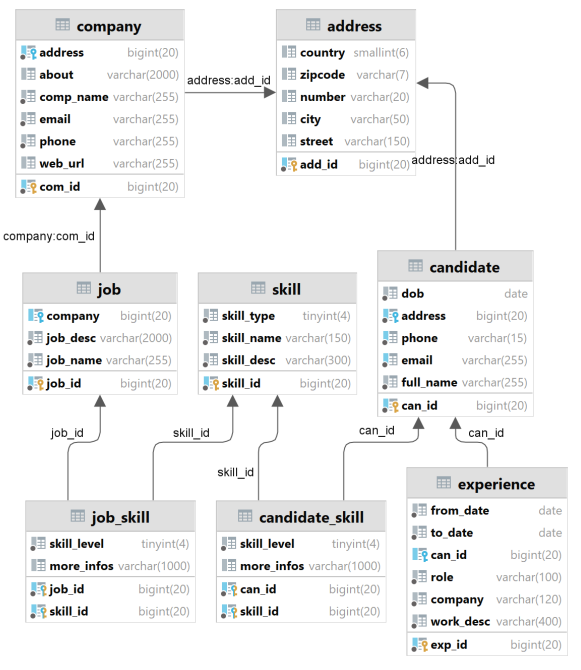

## TranThiMinhHuyen_20105231_WWW_Lab5

# Database diagram

# Rule
It consists of two parts, allowing the company to post job vacancies with desired skills, and when candidates enter their recruitment information, they will be suggested job positions that match their skills.

The company will see candidates with matching skills and send them an invitation email.

Candidates will be recommended some skills that they do not have for learning.

# UI
1. Home page
    
2. Page to view job listings
    
3. Create a new job
    
4. Page to view job listings
    
5. Review candidates who match the job
    
6. View candidate's detailed information
    
4. View the list of candidates, candidates can view their own information and see the companies that match their profile as well as their skills in relation to various job positions.
    
    
